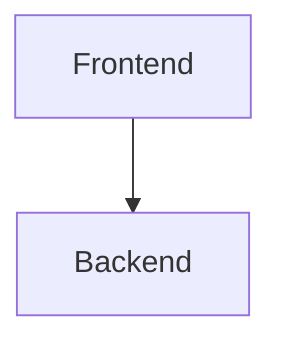

# Software Requirements Specification (SRS)

## Diagrams
*(Include Mermaid JS System Architecture diagrams here)*

## 1. Introduction
### 1.1 Purpose
The purpose of this document and the intended technical and non-technical audience.
### 1.2 System Overview
High-level description of the software system and its architectural context.
### 1.3 Definitions and Abbreviations
| Term | Definition |
| :--- | :--- |
| **API** | Application Programming Interface |

## 2. Overall Description
### 2.1 System Context
System relationships to other external/internal systems (e.g., identity providers, external databases).
### 2.2 User Classes and Characteristics
Identify the primary user classes (e.g., Authenticated User, Guest) and their technical level, frequency of use, and key tasks.
### 2.3 Operating Environment
Hardware, software, platform, required environment variables, and data model constraints.

## 3. System Features & Functional Requirements
### 3.1 [Feature / Component Name]
**FR-3.1.1:** The system shall... `[BR-001]`  
- **Input:** Specific expected inputs (parameters, fields).  
- **Processing:** Execution logic, validations, and database updates.  
- **Output:** Status codes, UI feedback, or redirect targets.  
- **Tables:** Database tables affected.  
- **Validation Rules:** Constraints to be enforced.  
- **Negative Scenario:** Expected behavior if input is invalid or state is incorrect.  

*(Repeat section 3.1 for all major system components)*

## 4. External Interface Requirements
- **User Interfaces:** UI/UX standards, accessibility compliance (WCAG).
- **Hardware Interfaces:** E.g., barcode scanners, IoT devices.
- **Software Interfaces:** Webhooks, REST/GraphQL APIs, database connections.
- **Communications Interfaces:** Network protocols, SSL/TLS requirements.

## 5. Non-Functional Requirements (NFRs)
- **Performance:** Response times (e.g., < 200ms), throughput.
- **Security:** Authentication, data encryption at rest and in transit, compliance.
- **Reliability & Availability:** Uptime SLAs (e.g., 99.9%).
- **Scalability:** Concurrent user load handling.

## 6. System Constraints
- **Technical Constraints:** Auth dependencies, data model limitations, network logic.
- **Business Constraints:** Key environment configurations, scalability boundaries.
