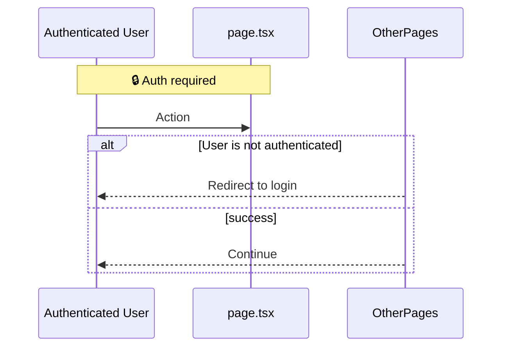

# User Story Backlog

## Epic Summary
- **[Epic 1 Name]:** Brief summary of the epic's purpose and scope.
- **[Epic 2 Name]:** ...

---

## Epic: [Epic 1 Name]

### US-001: [Story Title]
**As a** [Persona/Role]  
**I want to** [Action/Feature]  
**So that** [Business Value]  

**Priority:** Must Have / Should Have / Could Have / Won't Have  
**Story Points:** [1, 2, 3, 5, 8...]  
**Pages:** `filename.tsx`, `page.tsx`  
**Tables:** `tableName`  

**Acceptance Criteria:**
- [ ] System successfully executes [logic] upon valid submission `[BR-XX]`
- [ ] System rejects access and displays an error if [condition] `[BR-YY]`

**Notes:** Any additional context or constraints.

---

*(Repeat for US-002, US-003, etc.)*

---

*Sequence: [Epic Flow Name]*

## Epic: [Epic Flow Name] (Flow)
**As an** [Role], **I want to** navigate and process [Flow], **so that** I can achieve [Goal].

- **Story Points:** [Estimate]
- **Priority:** [Priority Level]

### Flow Acceptance Criteria
1. **Happy Path:** When user navigates to X, system renders Y `[BR-XX]`.
2. **Failure Case:** If unauthenticated user attempts Z, system intercepts and redirects to login `[BR-YY]`.

---

## Backlog Summary Table
| Story ID | Title | Epic | Priority | Points | Status |
| :--- | :--- | :--- | :--- | :--- | :--- |
| US-001 | Story Title Here | Epic Name | Must Have | 3 | To Do |
| US-002 | ... | ... | ... | ... | ... |

## Total Story Points
*   **Must Have:** [Total] (US-001, ...)
*   **Should Have:** [Total]
*   **Could Have:** [Total]
*   **Won't Have:** [Total]
